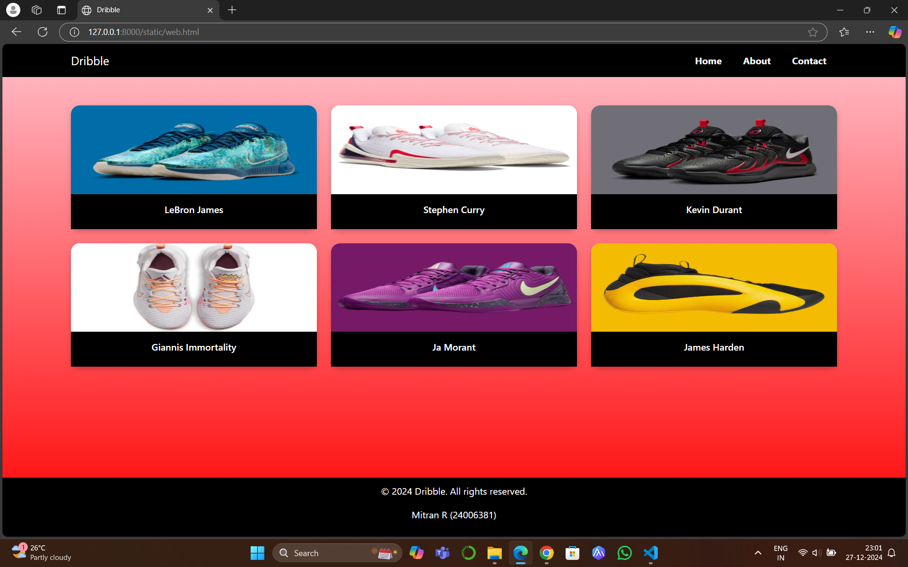
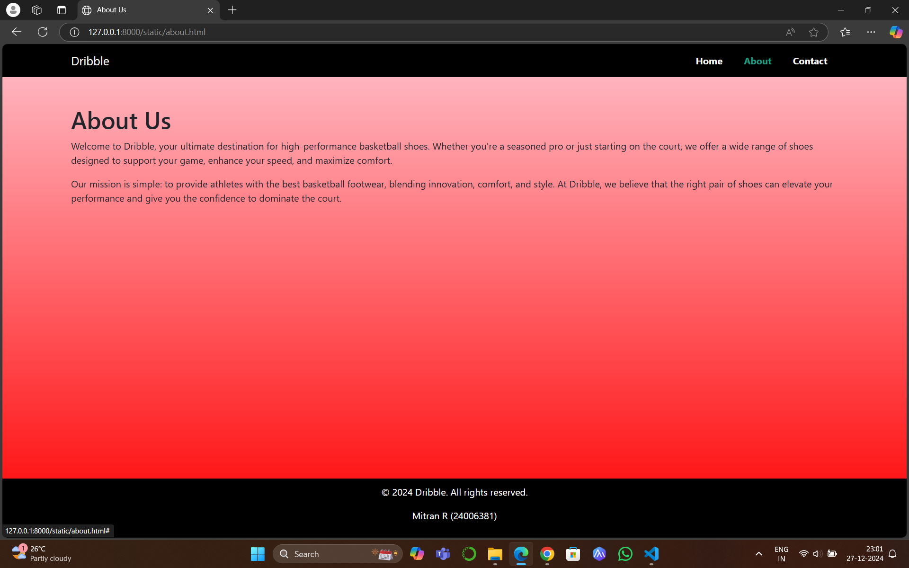
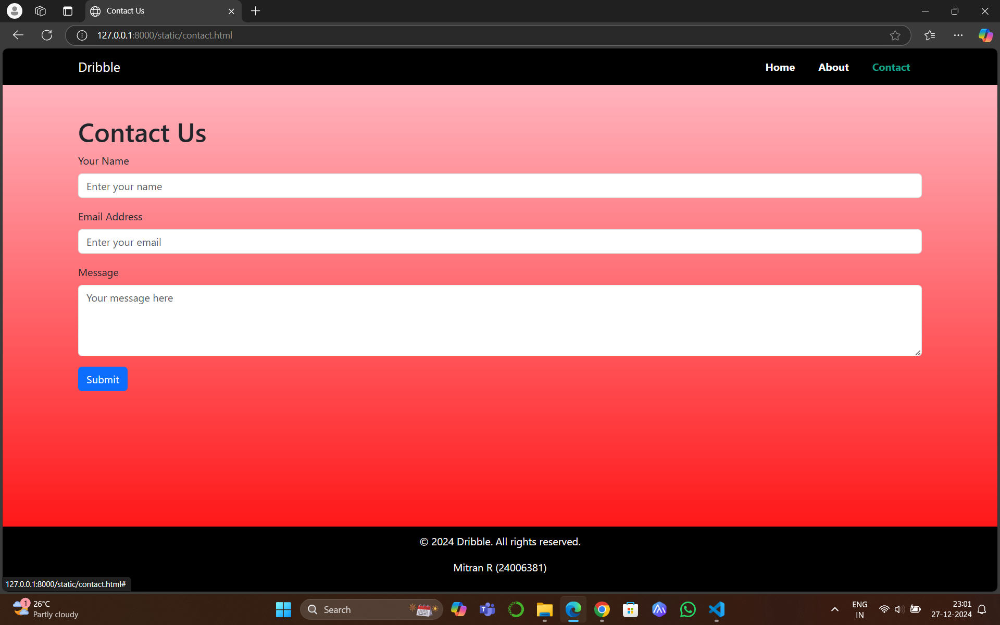

# Project Responsive Web Design using Bootstrap
## Date:27-12-2024

## AIM:
To create a simplified clone of Dribbble (https://dribbble.com/) landing page.


## DESIGN STEPS:

### Step 1:
Clone the repository from GitHub.

### Step 2:
Create Django Admin project.

### Step 3:
Create a New App under the Django Admin project.

### Step 4:
Insert the necessary CSS and JavaScript files as external in order to use Bootstrap.

### Step 5:
Create a HTML file and include the needed Bootstrap components.

### Step 6:
Publish the website in the LocalHost.

## PROGRAM :

```
web.html

<html>
<head>
  <title>Dribble</title>
  <link href="https://cdn.jsdelivr.net/npm/bootstrap@5.3.0/dist/css/bootstrap.min.css" rel="stylesheet">
  <style>
    html, body 
    {
      height: 100%;
      margin: 0;
      display: flex;
      flex-direction: column;
    }
    body 
    {
      background: linear-gradient(pink, red);
    }
    .content 
    {
      flex: 1;
    }
    .navbar 
    {
      background-color: black;
    }
    .navbar .nav-link 
    {
      color: white;
      font-weight: bold;
      margin: 0 10px;
    }
    .navbar .nav-link:hover 
    {
      color: pink;
    }
    .card 
    {
      border: none;
      border-radius: 15px;
      box-shadow: 0 4px 8px rgba(0, 0, 0, 0.2);
      transition: transform 0.3s, box-shadow 0.3s;
    }
    .card:hover 
    {
      transform: scale(1.05);
      box-shadow: 0 8px 16px rgba(0, 0, 0, 0.3);
    }
    .card img 
    {
      height: 150px;
      background-size: cover;
      border-top-left-radius: 15px;
      border-top-right-radius: 15px;
    }
    .card-body 
    {
      background-color: black;
      color: white;
      text-align: center;
    }
    footer 
    {
      background-color: black;
      color: white;
      text-align: center;
      padding: 10px 0;
    }
  </style>
</head>
<body>
  <nav class="navbar navbar-expand-lg">
    <div class="container">
      <a class="navbar-brand text-white" href="#">Dribble</a>
      <button class="navbar-toggler" type="button" data-bs-toggle="collapse" data-bs-target="#navbarNav" aria-controls="navbarNav" aria-expanded="false" aria-label="Toggle navigation">
        <span class="navbar-toggler-icon"></span>
      </button>
      <div class="collapse navbar-collapse" id="navbarNav">
        <ul class="navbar-nav ms-auto">
          <li class="nav-item"><a class="nav-link" href="#">Home</a></li>
          <li class="nav-item"><a class="nav-link" href="about.html">About</a></li>
          <li class="nav-item"><a class="nav-link" href="contact.html">Contact</a></li>
        </ul>
      </div>
    </div>
  </nav>

  <div class="container my-5 content">
    <div class="row g-4">
      <div class="col-6 col-md-4">
        <div class="card">
          
          <div class="card-body">
            <h6 class="card-title">LeBron James</h6>
          </div>
        </div>
      </div>
      <div class="col-6 col-md-4">
        <div class="card">
          
          <div class="card-body">
            <h6 class="card-title">Stephen Curry</h6>
          </div>
        </div>
      </div>
      <div class="col-6 col-md-4">
        <div class="card">
          
          <div class="card-body">
            <h6 class="card-title">Kevin Durant</h6>
          </div>
        </div>
      </div>
      <div class="col-6 col-md-4">
        <div class="card">
          
          <div class="card-body">
            <h6 class="card-title">Giannis Immortality</h6>
          </div>
        </div>
      </div>
      <div class="col-6 col-md-4">
        <div class="card">
          
          <div class="card-body">
            <h6 class="card-title">Ja Morant</h6>
          </div>
        </div>
      </div>
      <div class="col-6 col-md-4">
        <div class="card">
          
          <div class="card-body">
            <h6 class="card-title">James Harden</h6>
          </div>
        </div>
      </div>
    </div>
  </div>

  <footer>
    <p>&copy; 2024 Dribble. All rights reserved.</p>
    <p>Mitran R (24006381)</p>
  </footer>
</body>
</html>

about.html

<html>
<head>
  <title>About Us</title>
  <link href="https://cdn.jsdelivr.net/npm/bootstrap@5.3.0/dist/css/bootstrap.min.css" rel="stylesheet">
  <style>
    body 
    {
      background: linear-gradient(pink, red);
      margin: 0;
      display: flex;
      flex-direction: column;
      min-height: 100vh;
    }
    .content 
    {
      flex: 1;
    }
    .navbar 
    {
      background-color: black;
    }
    .navbar .nav-link 
    {
      color: white;
      font-weight: bold;
      margin: 0 10px;
    }
    .navbar .nav-link:hover 
    {
      color: #16a085;
    }
    footer 
    {
      background-color: black;
      color: white;
      text-align: center;
      padding: 10px 0;
    }
  </style>
</head>
<body>
  <nav class="navbar navbar-expand-lg">
    <div class="container">
      <a class="navbar-brand text-white" href="#">Dribble</a>
      <button class="navbar-toggler" type="button" data-bs-toggle="collapse" data-bs-target="#navbarNav" aria-controls="navbarNav" aria-expanded="false" aria-label="Toggle navigation">
        <span class="navbar-toggler-icon"></span>
      </button>
      <div class="collapse navbar-collapse" id="navbarNav">
        <ul class="navbar-nav ms-auto">
          <li class="nav-item"><a class="nav-link" href="index.html">Home</a></li>
          <li class="nav-item"><a class="nav-link active" href="#">About</a></li>
          <li class="nav-item"><a class="nav-link" href="contact.html">Contact</a></li>
        </ul>
      </div>
    </div>
  </nav>

  <div class="container my-5 content">
    <h1>About Us</h1>
    <p>Welcome to Dribble, your ultimate destination for high-performance basketball shoes. Whether you're a seasoned pro or just starting on the court, we offer a wide range of shoes designed to support your game, enhance your speed, and maximize comfort.</p>
    <p>Our mission is simple: to provide athletes with the best basketball footwear, blending innovation, comfort, and style. At Dribble, we believe that the right pair of shoes can elevate your performance and give you the confidence to dominate the court.</p>
  </div>

  <footer>
    <p>&copy; 2024 Dribble. All rights reserved.</p>
    <p>Mitran R (24006381)</p>
  </footer>
</body>
</html>

contact.html

<html>
<head>
  <title>Contact Us</title>
  <link href="https://cdn.jsdelivr.net/npm/bootstrap@5.3.0/dist/css/bootstrap.min.css" rel="stylesheet">
  <style>
    body 
    {
      background: linear-gradient(pink, red);
      margin: 0;
      display: flex;
      flex-direction: column;
      min-height: 100vh;
    }
    .content 
    {
      flex: 1;
    }
    .navbar 
    {
      background-color: black;
    }
    .navbar .nav-link 
    {
      color: white;
      font-weight: bold;
      margin: 0 10px;
    }
    .navbar .nav-link:hover 
    {
      color: #16a085;
    }
    footer 
    {
      background-color: black;
      color: white;
      text-align: center;
      padding: 10px 0;
    }
  </style>
</head>
<body>
  <nav class="navbar navbar-expand-lg">
    <div class="container">
      <a class="navbar-brand text-white" href="#">Dribble</a>
      <button class="navbar-toggler" type="button" data-bs-toggle="collapse" data-bs-target="#navbarNav" aria-controls="navbarNav" aria-expanded="false" aria-label="Toggle navigation">
        <span class="navbar-toggler-icon"></span>
      </button>
      <div class="collapse navbar-collapse" id="navbarNav">
        <ul class="navbar-nav ms-auto">
          <li class="nav-item"><a class="nav-link" href="index.html">Home</a></li>
          <li class="nav-item"><a class="nav-link" href="about.html">About</a></li>
          <li class="nav-item"><a class="nav-link active" href="#">Contact</a></li>
        </ul>
      </div>
    </div>
  </nav>

  <div class="container my-5 content">
    <h1>Contact Us</h1>
    <form>
      <div class="mb-3">
        <label for="name" class="form-label">Your Name</label>
        <input type="text" class="form-control" id="name" placeholder="Enter your name">
      </div>
      <div class="mb-3">
        <label for="email" class="form-label">Email Address</label>
        <input type="email" class="form-control" id="email" placeholder="Enter your email">
      </div>
      <div class="mb-3">
        <label for="message" class="form-label">Message</label>
        <textarea class="form-control" id="message" rows="4" placeholder="Your message here"></textarea>
      </div>
      <button type="submit" class="btn btn-primary">Submit</button>
    </form>
  </div>

  <footer>
    <p>&copy; 2024 Dribble. All rights reserved.</p>
    <p>Mitran R (24006381)</p>
  </footer>

  <script src="https://cdn.jsdelivr.net/npm/bootstrap@5.3.0/dist/js/bootstrap.bundle.min.js"></script>
</body>
</html>

```

## OUTPUT:







## RESULT:
The Project for responsive web design using Bootstrap is completed successfully.
